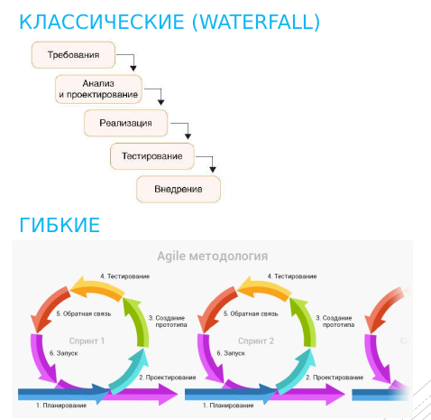
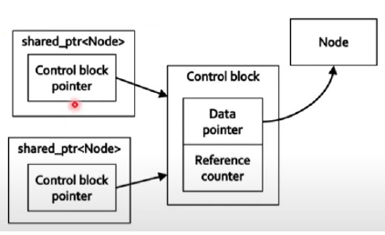
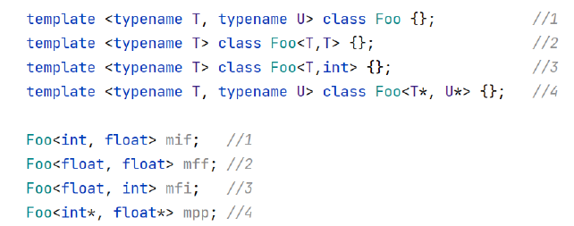
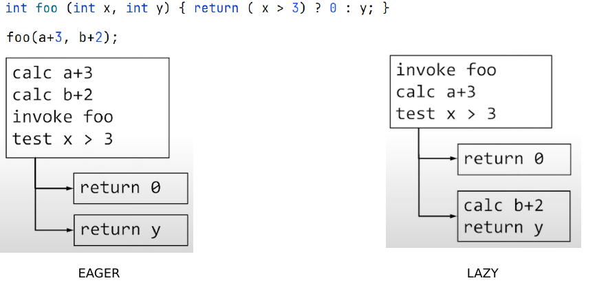
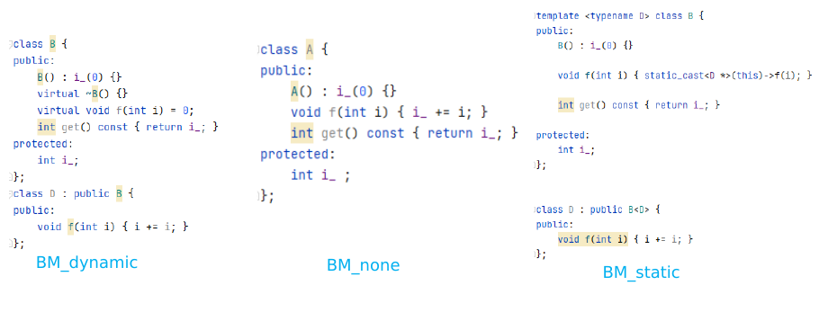
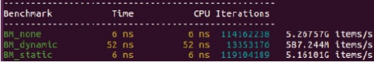
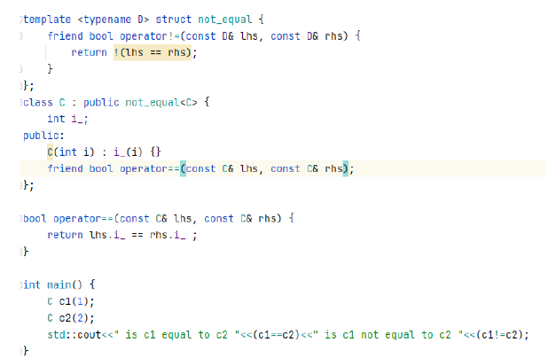
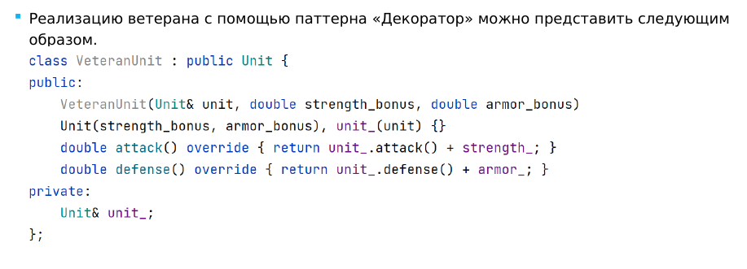

1.  Cmake. Написать Cmake для проекта, состоящего из main.cpp, class1.h, class1.cpp. Стандарт С++ - 17.
```cpp
cmake_minimum_required (VERSION 3.5)
set (project PROJECT)
project (${project} LANGUAGES CXX)

set (CMAKE_CXX_STANDART 17)
set (CMAKE_CXX_STANDART_REQUIRED ON)

set (SOURCES main.cpp class1.cpp)
set (HEADERS class1.h)

add_executable (${project} ${SOURCES} ${HEADERS})
```

2.  Cmake. Алгоритм сборки библиотеки без зависимостей из исходных кодов, которые содержат CmakeLists.txt.
???

3.  Cmake. Добавление сторонней прекомпилированной библиотеки к своему проекту.
```cpp
// Пример на QTSQL
find_package (QT5 COMPONENTS Sql REQUIRED)
target_link_libraries (${project} PRIVATE Qt5::Sql)
```

Команды GITa:
- `git init` - создание репозитория
- `git clone` - клонирование репозитория
- `git status` - состояние репозитория
- `git add` - добавление новых файлов в индекс
- `git rm` - удаление файлов из индекса
- `git commit` -m - фиксация изменений (вместе с текстом)
- `git push` - добавление изменений в удаленный репозиторий
- `git pull` - получение актуальных данных из репозитория

4. Отличие `switch` от `checkout`.
```bash
# Создание новой ветки и переход
git checkout -b <name>
git switch -c <name>

# Переход на другую ветку
git checkout <name>
git switch <name>
```

`checkout` - старая функция, которая позволяет не только переключаться на другие ветки, но и для отката изменений в определенном файле. Из-за путаницы стали разделять функционал на `switch` - работу с ветками и `restore` - работу с файлами.

5. Отличия `rebase/merge/cherry-pick`.
`git cherry-pick <commit-hash>` - используется для перенесения отдельных коммитов из одного места репы в другое. Обычно из разработки в обслуживание.
`git rebase` - "автоматизированный черри-пик". Он выполняет ту же работу, но на целую цепочку коммитов.
`git merge` - слитие нескольких веток.

Основное отличие в том, что слияние сохраняет историю в первозданном виде, перебазирование ее перезаписывает, а черри-пик вносит единичные изменения.

6. Git. Что нужно сделать, чтобы зафиксировать изменения в локальном репозитории и добавить их в удаленный репозиторий.
```bash
git remote add origin <url>
git add .
git commit -m "Changes"
git push origin <branch>
```

7. Отличия waterfall от agile


8. Алгоритм Флойда


9. Инварианты класса. Определение.
Инвариант класса - утверждение, которое должно быть верно все время жизни обьекта класса. Примером может быть какая-либо проверка на корректность параметров класса, которую необходимо проводить для избежания ошибок.

10. Инкапсуляция. Определение.
Инкапсуляция - разделение элементов абстракций. Она предназначена для изоляции конкретных методов и параметров от сторонних функций.

11. Модификатор доступа в классе по умолчанию.
В классе по умолчанию все поля `private`.

12. Наследование в классе/структуре по умолчанию.
Наследование - концепция ООП, которая позволяет определять новые классы как расширение существующих.
Разделяют открытое (A является B) и закрытое (A принадлежит B) наследование.
Открытое - класс поддерживает открытые методы класса родителя, сохраняет инварианты и тд.

По умолчанию в классе - закрытое, в структуре - открытое.

13. Отличия `private`/`public`/`protected`.
- `private` - закрыто от сторонних и от детей
- `public` - открыто для всех
- `protected` - открыто только для детей

14. Отличия `malloc`/`free` от `new`/`delete`.
Инкапсуляция делает критически важными конструкторы и деструкторы, т.к. состояние и очистку извне провести нельзя.

Сишные malloc и free не знают о конструкторах и деструкторах. Поэтому применяются новые new и delete - они, помимо выделения/очистки памяти вызывают конструктор и деструктор.

15. Когда не применима инициализация «в круглых скобках», «после =», «фигурная».
```cpp
int x (0); // Инициализатор в круглых скобках
int y = 0; // Инициализатор после "="
int z {0}; // Унифицированная инициализация
```

`=` - не применяется для некопируемых обьектов
`()` - не применяется при инициализации полей классов по умолчанию

16. (17)Сужающие преобразованию и разные виды инициализации.
```cpp
double x, y, z;

int sum {x + y + z}; // ошибка - запрет сужающих преобразований

std::vector <int> a (10, 20); // size - 10
std::vector <int> b {10, 20}; // size - 2
```

При наличии конструктора, принимающего std::initializer_list в качестве аргумента - будет использован именно он.

18. В каких случаях возникает двойная инциализация.
Двойная инициализация возникает при присваивании к обьекту класса/структуры в конструкторе. Для того, чтобы уйти от нее предусмотрены списки инициализации.

```cpp
struct Node {
	S key_;
	int val_;
	Node (int key, int val) : key_ {key}, val_ {val} {};
}
```

19. В каком порядке выполняется инициализация полей класса с использованием списков инициализации (в порядке расположения полей класса или в порядке, определенном в списке инициализации)?
Список инициализации выполняется строго в том порядке, в каком поля определены в классе (не в том, в каком они записаны в списке).

20. Что такое RVO?
RVO (return value optimization) - оптимизация компилятора, позволяющая в некоторых случаях не создавать локальный обьект, который будет использован как возвращаемое значение. Вместо этого локальный обьект будет сконструирован на месте вызова функции. Это позволяет устранить лишний вызов конструктора перемещения/копирования.

21. (22, 23)Полиморфизм. Определение. Виды полиморфизма.
Полиморфизм - концепция ООП, которая позволяет для единого интерфейса представить множество реализаций в зависимости от аргументов.

- Статический - выбор реализации осуществляется во время компиляции (перегрузки функций, шаблоны)
- Динамический - выбор реализации осуществляется во время выполнения (виртуальные функции)

24. Отличие overloading от overriding
Overloading (перегрузка функции) - введение того же имени с другими типами аргументов
Overriding (переопределение функции) - замещение в классе наследнике виртуальной функции класса родителя

25. (26) Ключевое слово virtual/override
очевидно

27. (28)Абстрактный класс. Определение
Абстактный класс - класс, который содержит хотя бы одну виртуальную функцию. Виртуальный конструктор невозможен.

```cpp
struct Shape {
	virtual Shape* clone () const = 0;
}

template <typename T> struct Rect: Shape {
	T length;
	T width;

	Rect* clone () const override {
		return new Rect (length, width);
	};
};
```

Виртуальные функции связываются динамически (адреса функций определяются с помощью таблицы виртуальных функций).
Обычные функции связываются статически (на этапе компиляции).

29. NVI
NVI (non-virtual-interface)

Аргументы по умолчанию связываются статически, т.е. зависят от статического типа.
Если нужен интерфейс с аргументами по умолчанию, его можно сделать невиртуальным, чтобы никто не мог их переопределить.

```cpp
struct BaseNVI {
	int foo (int x = 14) { return foo_impl(x); };
private:
	virtual int foo_impl (int a) { return a; };
};

struct DeriveNVI {
	int foo_impl (int a) override {return a*2;};
};
```

30. (31, 32) Можно ли перегружать виртуальные функции класса? Можно ли осуществить шаблон виртуального метода?
Да/Нет
Исправление - добавление using.
```cpp
#include <iostream>

using namespace std;

struct Matrix {
    virtual void pow(double x) { cout << "slow for double" << endl; }
    virtual void pow(int x) { cout << "slow for int" << endl; }
};

struct SparceMatrix : Matrix {
	using Matrix::pow; // исправление для вывода обоих double
    void pow(int x) override { cout << "fast for int" << endl; };
};

int main()
{
    Matrix* m = new SparceMatrix;
    m->pow(1.5);
    SparceMatrix d;

    d.pow(1.5);
    return 0;
}

//Выводите slow for double и fast for int
```

33. (34)Чем плох `goto`?
GoTo considered harmful.
Он превращает алгоритм из дерева в граф. А их сложно анализировать на предмет ошибок - особенно, утечек памяти.

`break`, `continue`, `switch` - `goto`-функции, но скрытые и приемлемые.

35. RAII. Концепция
RAII - resource acquisition is initialization. Получение ресурса есть инициализация.
Конструктор захватывает владение ресурсом, а деструктор его высвобождает.

36. Инвариант умного указателя с единственным владельцем.
???
37. DrillDownBehavior. Где применяется
???

38. Lvalue и Rvalue. Отличия.
Lvalue - переменная, которая хранится в памяти.
Rvalue - некоторое выражение над Lvalue, которое не хранится в памяти.

39. RValue ссылки
Rvalue reference - операции взять выражение, связать выражение с именем и материализовать обьект выражения.

40. Что делает `std::move`?
Берет Lvalue ref и приводит его к Rvalue ref;
```cpp
int&& y = std::move (x);
```

Еще про R и L:
```cpp
int main () {
	int x = 4;
	int &&y = x + 1;
	std::cout << &x << " " << &y << std::endl;

	int &&z = std::move (x);
	z = z + 1;
	y = y + 1;
	std::cout << x << " " << y << std::endl;
}

// выведет два разных адреса
// затем 5 и 6

// правая ссылка не может быть связана с lvalue

int x = 1;
int && y = x + 1; // ok
int &&b = x; // fail, не rvalue

// неконстантная левая ссылка не может быть связана с rvalue

int &c = x + 1; // faile, not rvalue
const int &d = x + 1; // ok

// но при этом праввая ссылка сама по себе задает имя и адрес и является lvalue

int &&e = y; // faile, not rvalue
int &f = y; // ok
```

41. Правило нуля, трех, пяти.
Правила, что если класс или структура определяет один из след. методов, то они должны явным образом определять все остальные.
Трех:
- Деструктор
- Конструктор копирования
- Оператор присваивания копированием

Пяти:
- +Конструктор перемещения
- +Оператор присваивания перемещением

Нуля - сценарий, когда не нужно определять ничего из специальных функций-членов, должен быть предпочтительным.

42. Виды умных указателей
- unique_ptr - воплощает в себе семантику исключительного владения
- shared_ptr - воплощает в себе семантику совместного владения
- weak_ptr - не владеет обьектом, на который указывает

43. Отличие unique_ptr от shared_ptr
Основная идея unique_ptr - использовать для передачи управления перемещение. Интеллектуальные указатели unique_ptr легко преобразуются в shared_ptr.

Базовая проблема RAII - копирование. Реализация unique_ptr предполагает отказ от копирования, совмещенный с семантикой перемещения.


Так устроен указатель со совместным владением - все владеющие указатели могут читать и изменять их. Специальная структура - контрольный блок, который действительно владеет ресурсом.

```cpp
std::shared_ptr <Node> p1 = std::make_shared <Node> ();
std::shared_ptr <Node> p2 {new Node()};
```
Первый случай - одним выделением памяти создается и контрольный блок и данные.
Второй - сначала данные, а в конструкторе контрольный блок.

44. Отличия weak_ptr от shared_ptr
weak_ptr - не владеет обьектом, на который указывает. Это ликвидирует проблему закольцованных указателей.
```cpp
struct Node {
	// std::weak_ptr <Node> parent; - решение
	std::shared_ptr <Node> parent, left, right;
};
{
	std::shared_ptr <Node> master = std::make_shared <Node>(); // счетчик 1
	std::shared_ptr <Node> slave = std::make_shared <Node> (); // счетчик 1

	slave -> parent = master; // счетчик 2
	master -> left = slave; // счетчик 2
} // LEAK
```

В отличии от сырых - слабый указатель знает, когда обьект больше не существует. Также его нельзя разыменовать, но можно превратить в сильный и потом разыменовать.

45. Способы инициализации shared_ptr.
```cpp
Node* n = new Node {};
std::shared_ptr <Node> sp1 {n};
std::shared_ptr <Node> sp2 {n};
```
Такое создание двух разделяемых указателей приводит к созданию двух контрольных блоков, вместо одного и проблеме двойного удаления. Решение - использование make_shared.

46. ODR
ODR - ine definition rule. У каждой сущности есть declaration и definition, когда определяется ее положение в памяти.
ODR - сколько угодно declarations, не более чем один definition.

47. Include guard
`#include` guard - защита подключения. Это особая конструкция, применяемая для избежание проблем с двойным подключением при использовании `#include`.

48. CV-квалификаторы при выводе типов
CV-квалификаторы - это свойства идентификаторов, например `const`.
Ддя параметров, являющихся типами работает вывод типов.
```cpp
int x = std::max (1, 2); // int std::max <int> (int, int)

const int& a = 1;
const int& b = 2;
int x = std::max (a, b); // int std::max <int> (int, int)
```
При выводе типов режутся ссылки и внешние cv-квалификаторы.

49. Манглирование имен.
Как перегрузки функций представляются компилятором?
При перегрузке функций компилятор делает "манглированное" имя - добавляет в название дополнительную информацию, например размер аргументов для внутренних целей.

50. Правила разрешения перегрузки для нешаблонных функций
- Идеальное совпадение выигрывает
- Все стандартные преобразования равны
```cpp
int foo (char x);
int foo (long x);

auto x = foo (1); // FAIL
// Любые стандартные преобразования выигрывают у пользовательских
```
- Троеточия проигрывают почти всему
Они выигрывают только у неправильных ссылок.

Запрет перегрузок
```cpp
int foo (bool) = delete;
```

51. Правила разрешения перегрузки для шаблонных функций
- Точно подходящая функция выигрывает у шаблона
- Более специальный шаблон выигрывает у менее специального
- Меньшее количество аргументов выигрывает против большего

52. Что такое специализация шаблонного класса?
Специализация - механизм языка, предназначенный для специализации обобщённых шаблонных классов под конкретные задачи или под конкретное подмножество своих параметризованных типов данных.
```cpp
template <typename T> class Stack {
	fwnode <T> *top_;
};

template <> class Stack <int> {
	int* content_;
};
```
Также можно специализировать функции.
```cpp
template <typename T> void foo (T x);
template <> void foo (int* x);
```

53. Что такое частичная специализация шаблонного класса?
```cpp
template <typename T> class Stack {
	fwnode <T> *top_;
};

template <typename T> class Stack <T*> {
	T** content_; // массив указателей
}
```
Примеры:


54. Правила вывода типов для auto.
auto выводит типы так же как шаблоны функций с теми же правилами для уточненных.
```cpp
const int& x = 42;
auto y = x; // int y = x;
auto& z = x; // int& z = x;

int const * const px = &x;
auto py = px; // int const * py = px;
auto *pz = px; // int const * const pz = px;
```

Дополнительные правила:
```cpp
auto x = new auto ('c'); // char *c = new char ('c');
auto a = 1, b = 1.0; // error
auto y {1}; // int y{1};
auto z = {1}; // std::initializer_list <int> z = {1};
```

55. Что делает decltype?
`decltype (name)` - вывод точного типа name.
```cpp
void foo (const float& x) {
	decltype (x) tmp = x; // const float& tmp = x
}
```

56. Когда используем auto, а когда decltype для вывода типов?
auto деградирует типы:
```cpp
void foo (const float& x) {
	auto tmp = x; // float tmp = x
}
```
Если мы не хотим использовать значение x - используем decltype.

Вывод типа возвращаемого значения:
```cpp
template <class T>
auto makeAndProcess (const T& builder) -> decltype (builder.create ())
{
	auto res = builder.create();
	return res;
}
```

57. Когда C++ осуществляет "ленивые", а не "энергичные" вычисления?

Ленивый:
- При сокращенных вычислениях
```cpp
if (p && (p -> x == 3))
```
- При инстанцировании шаблонов

58. SFINAE.
Substitution Failure Is Not An Error (провал подставновки не является ошибкой).
Если в результате подстановки в непосредственном контексте класса (функции, класса, переменной) возникает невалидная конструкция - то эта подстановка неуспешна, но не ошибочна.

```cpp
template <typename T> T max (T a, T b)
{
	return (a > b) ? a : b;
}; // 1
template <typename T, typename U> auto max (T a, U b)
{
	return (a > b) ? a : b;
}; // 2

auto g = max (1, 1.0); // подстановка в 1 провалена, а в 2 успешна
```

59. Про SNIFAE в старом C++
???
60. Про SNIFAE в новом C++
???

61. CRTP
CRTP - curiously recursive template pattern.

Пример:



BM_dynamic - использует виртуальную функцию, которая вызывается от указателя на базовый класс, инициализированного производным классом.

62. Ограничения CRTP
Основное ограничение CRTP заключается в том, что размер базового класса B не может зависеть от его параметра шаблона D. Вообще, шаблон класса B конкретизируется неполным типом D.

63. Реализация чисто виртуальных функций в CRTP
```cpp
template <typename D> class B {
public:
	void f (int i) { static_cast <D*> (this) -> f_impl (i); }
};

class D : public B <D> {
public:
	void f_impl (int i) { i += 1; }
};

int main () {
	B <D>* b;
	b -> f(5);
}
```

64. Реализация виртуальных функций в CRTP
```cpp
template <typename D> class B {
public:
	void f (int i) { static_cast <D*> (this) -> f_impl (i); }
	void f_impl (int i) {}
};

class D : public B <D> {
public:
	void f_impl (int i) { i += 1; }
};

class D1 : public B <D1> {
	//Здесь нет f()
};

int main () {
	B <D>* b;
	b -> f(5); // вызывается D::f()

	B <D1>* b1;
	b1 -> f(5): // вызывается B::f()
}
```

65. Реализация методов для удаления объекта в CRTP
В декструкторе базового класса фактический объект уже не принадлежит производному типу, и вызов функций-членов производного класса приводит к неопределенному поведению.
Решения:
- Использование сторонних методов для удаления
```cpp
template <typename D> void destroy (B <D>* b) { delete static_cast <D*>(b); }
```
Соответствует паттерну CRTP, но необходимо следить, чтобы обьекты удалялись через destroy, а не через delete.

- Сделать виртуальный деструктор
Не надо следить за удалением, но появляются накладные расходы на вызов виртуальной функции для деструктора и размер обьекта увеличивается на размер указателя.

66. Способы применения CRTP.
Все выше и нижеперечисленное + реестр обьектов - иногда желательно знать, сколько обьектов определенного типа существует в данный момент, и вести список таких обьектов.
Любой тип, которому нужно вести реестр активных обьектов во время выполнения, должен всего лишь унаследовать функцию-регистратор.

67. Как применяется CRTP для делегирования?


68. Как работает ключевое слово required?
```cpp
template <class T>
int f (T x) requires (sizeof (T) > 4) { return 1; }

template <class T>
int f (T x) requires (sizeof (T) <= 4) { return 2; }
```
Перегрузка ограничений - функции с разными ограничениями являются разными функциями, а не перегрузками. Ограничения могут быть только у шаблонных функций.

69. Чем плохи SNIFAE ограничения?
SNIFAE ограничения не упорядочены в отношении ограниченности.

70. Что такое requires-expression? Отличия required-expression от required-clause.
Перепишем один пример с requires на requires-expression:
```cpp
template <class T, class U>
bool check_eq (T &&lhs, U &&rhs) requires is_equally_comparable <T, U>::value { return (lhs == rhs); }

template <class T, class U>
bool check_eq (T &&lhs, U &&rhs) requires requires (T t, U u) { u == t;} { return (lhs == rhs); }
```

requires-claues вычисляются на этапе компиляции. requires-expression проверяют валидность кода.

71. Виды requires-expression.
- Простые ограничения - истинны, если выражение валидно
- Типовые ограничения - истинны, если выражение - существующий тип
- Составные ограничения - комбинация простого ограничения и ограничения типа, проверяют совместимость типа с выражением
- Вложенные ограничения - содержат required-clause

```cpp
requires (T t, U u) {
	u + t; // простое
	typename T::inner; // типа
}
```

72. Что такое концепт?
Концепты позволяют создать аббревиатуру для requires-expression. По сути очень похожи на constexpr bool.
```cpp
template <class From, class To>
concept convertible_to = std::is_convertible_v <From, To> && requires (From (&f)()) { static_cast <To> (f()); }
```

Концепты могут содержать еще концепты
```cpp
template <class T, class U>
concept WeaklyComparableWith = requires (T t, U u) {
	{t == u} -> convertible_to <bool>;
	{t != u} -> convertible_to <bool>;
	{u == t} -> convertible_to <bool>;
	{u != t} -> convertible_to <bool>;
};
```

Ограничение функций концептами.
Концепты можно использовать напрямую в обьявлении функции.
```cpp
template <class T, class U>
bool foo (T t, U u) requires WeaklyComparableWith <T, U>;

// для концептов существует отдельный синтаксис
template <class T>
void sort (T& x) requires Sortable <T>;

template <Sortable T> void sort (T& x);

//или так
template <convertible_from <int> T> struct S;
```

73. Отношения между концептами
Концепты могут участвовать в отношения большей или меньшей ограниченности.

74, 75, 76.
???

77. Паттерн Декоратор
Как правило, обертки классов используются либо для изменения API класса, либо для сохранения API, но дополнения его функционала.

Декоратор - структурный паттерн, который позволяет наделять обьект новым поведением. Декоратор реализует интерфейс исходного класса и переадресует этому классу запросы, адресованные его собственному интерфейсу, но кроме этого выполняет дополнительные действия до и/или после переадресованных запросов.

Пример "ветерана" - расширение юнита с увеличенной атакой и защитой.


78. CRTP Декоратор - полиморфный декоратор
Некоторые декораторы рассчитаны только на классы, которые модифицируют, и имеют узкую направленность.

Общие декораторы - протоколирование. Можно было бы использовать его с любой функцией.

```cpp
template <typename Callable> class DebugDecorator {
public:
	DebugDecorator (const Callable &c, const char *s) : c_(c), s_(s) {}

	template <typename ... Args>
	auto operator () (Args && ... args) const {
		cout << "Вызывается " << s_ << endl;
		auto res = c_ (std::forward <Args > (args) ...);
		cout << "Результат: " << res << endl;
		return res;
	}

private:
	const Callable &c_;
	const std::string s_;
};

template <typename Callable>
auto decorate_debug (const Callable& c, const char* s) {
	return DebugDecorator <Callable> (c, s);
}
```

79. Паттерн Адаптер
Адаптер - это структурный паттерн, который позволяет использовать интерфейс класса как другой, отличный от него интерфейс.

80. Минусы паттерна декоратор при реализации потокобезопасной очереди
???

81. Отличие паттерна декоратор от паттерна Адаптер
Адаптер - очень общий паттерн широкого назначения. Его можно использовать для реализации нескольких других, более узких паттернов, в частности Декоратора.

82. Паттерн Фабрика
Фабричный метод - это шаблон проектирования, который решает проблему создания обьектов продукта без указания их конкретных классов.

83, 84, 85
???